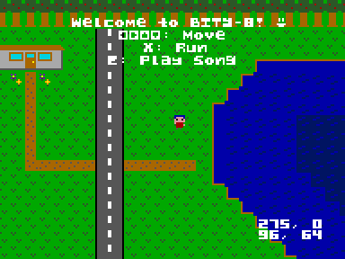

# 

BITY-8 is a fantasy console comparable to many others fantasy consoles: PICO-8,
TIC-80, LICO-12, PV8, and many more!

To understand what a fantasy console, imagine the old Nintendo Entertainment
System. Now put that console into a program. Shazam! You have an emulator.

The difference between an emulator and a fantasy console is that the
hardware for the fantasy console has never existed before, but it could!

Fantasy consoles are slowly gaining popularity because they are fun to play
with and fun to develop with. Begin your BITY-8 journey today!



## Hardware Specifications
### Main Specs
Specs may slightly change during alpha. But most are set in stone.
```
Cartridge: 256KB expandable space
Code:      Lua 5.2, cartridge stores source code
Display:   192x144 screen
           4-bit rewritable palette
           60 FPS
Input:     D-pad, A, B, START, SELECT
           4 controllers
Memory:    256KB read area
           64KB  read/write area
Music:     32 2-byte note measures, 4 measure staves
           0-255 staves
Map:       96x72 8-bit cell maps
           0-31 maps
Sprite:    96x72 4-bit pixel sheets
           0-63 sheets
Sound:     4 channel
           8 instruments (128 samples, 8-bit amplitudes)
           88-key (piano) range
           60 notes a second
           4 default waves (square, sawtooth, triangle, noise)
           4 custom waves
```

## Standard Library
Here is the list of supported standard library functions so far:

```
_peek _poke _mset _mcpy
_max _min _floor _ceil
_sin _cos _atan2
_sqrt _abs
_rand
_and _or _xor _not
_rotl
_draw_rect _draw_line
```

Note that the standard library is still in alpha, and may change at any time.

## Running Alpha
This assumes that you already have rust installed on your system. If you don't,
see [this](https://doc.rust-lang.org/book/ch01-01-installation.html).

Next, make sure you have both the `sdl2` and `sdl2_gfx` developer packages
installed on your system. On Arch Linux, this looks like:
```bash
sudo pacman -S sdl2 sdl2_gfx
```

If you have a different operating system/package manager, you may want to
consult [this page](https://github.com/Rust-SDL2/rust-sdl2).

After meeting those two requirements, it should be simple to run BITY-8 on your
machine:
```bash
# Clone the repo
git clone https://github.com/bity-8/bity-8.git

# Go into the demo directory.
cd bity-8/bity-8/assets/demo

# Compile the demo program.
./comp.sh

# And run the demo program with BITY-8!
cargo run out.b8
```

That's it, you have the alpha version of BITY-8 running on your machine now.
